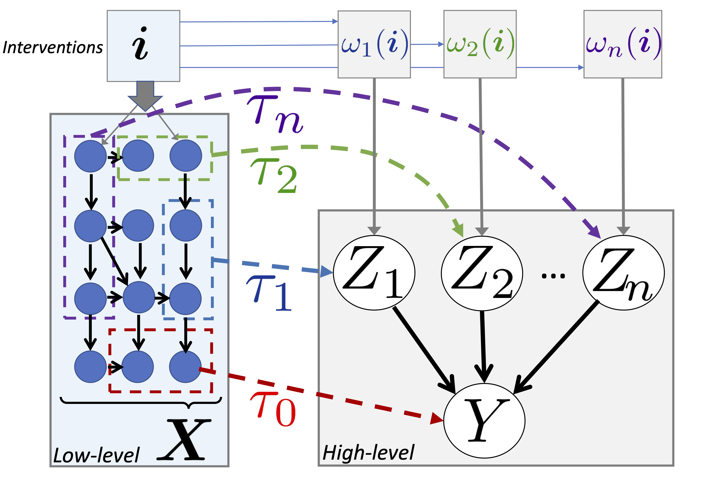

# Targeted Causal Reduction (TCR)
[](https://pytorch.org/)
[](https://lightning.ai/)
[](https://github.com/psf/black)
[](https://opensource.org/licenses/MIT)
[](https://arxiv.org/abs/2311.18639)


## Overview
TCR is a method for explaining a phenomenon (called **target**) in high-dimensional simulations (**low-level model**)
by learning a low-dimensional causal model (**high-level model**) that captures the most important causes of the target.
It uses shift interventions in the low-level model and its effects on the target to learn the high-level model.
The full mathematical details are explained in the [associated paper](https://arxiv.org/abs/2311.18639).

## Installation
Clone the repository
```bash
git clone git@github.com:akekic/targeted-causal-reduction.git
```
and install the package
```bash
pip install .
```
If you want to install the package for development, use
```bash
pip install -e .[dev]
```
this will install the package in editable mode and install the additional dependencies for development.

## Hello World!
The package provides an entry point for running the `TCR` algorithm.
To run the algorithm on a synthetic linear low-level causal model, use
```bash
tcr
```
This will run the `TCR` algorithm and save the results as weights and biases logs in the `wandb` directory.
The full list of arguments can be found by running
```bash
tcr --help
```
or by looking at the argument parser in [`targeted_causal_reduction/parser.py`](targeted_causal_reduction/parser.py).

## License
This project is licensed under the [MIT license](https://opensource.org/licenses/MIT).
See the [LICENSE](LICENSE) file for details.

## Citation

If you use `TCR`, please cite the 
[corresponding paper](https://arxiv.org/abs/2311.18639) as follows.

> Kekić, A., Schölkopf, B., & Besserve, M. (2024).
> Targeted Reduction of Causal Models. 
> Conference on Uncertainty in Artificial Intelligence (UAI).

**Bibtex**

```
@article{
    kekic2024targeted,
    title={Targeted Reduction of Causal Models},
    author={Keki\'c, Armin and Sch\"olkopf, Bernhard and Besserve, Michel},
    journal={Conference on Uncertainty in Artificial Intelligence (UAI)},
    year={2024},
}
```